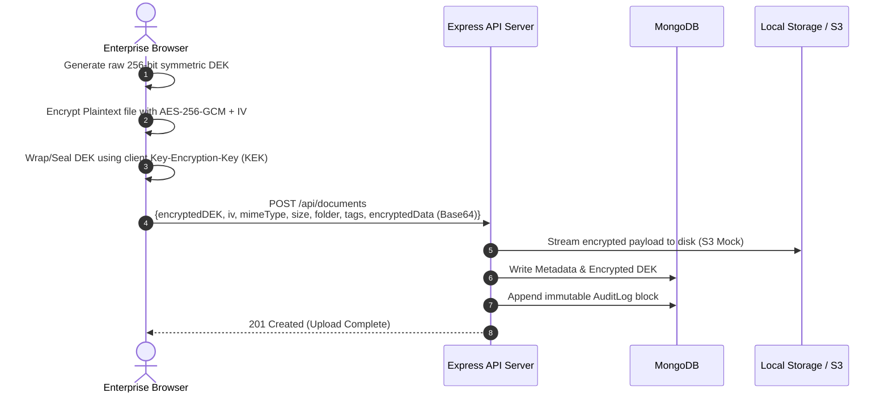

# 🛡️ AegisVault

### **Zero-Knowledge Enterprise Document Management System**

AegisVault is a state-of-the-art, enterprise-grade full-stack platform built on a strict **Zero-Knowledge Architecture**. By combining browser-side high-performance cryptography, blockchain-inspired immutable activity audit trails, granular role-based access controls, and real-time operations telemetry, AegisVault provides an uncompromising sanctuary for highly sensitive enterprise records.

Files uploaded to AegisVault are encrypted inside the user's browser sandbox using **AES-256-GCM** via the hardware-accelerated **Web Crypto API** *before* they are streamed to the backend. The backend only handles encrypted blobs and cryptographic metadata. Plaintext content and raw decryption keys are never visible to the server or database layers, establishing absolute mathematical confidentiality.

---

## 🎨 System Highlights & Features

*   **🔐 True Zero-Knowledge Sandbox:** File encryption/decryption is performed strictly client-side using `AES-256-GCM`. High-entropy Data Encryption Keys (DEKs) never leave the browser in plaintext.
*   **🔗 Cryptographic Audit Chains:** An immutable, chain-of-custody audit log verifies the mathematical integrity of all vault transactions. Each log hashes its parameters alongside the preceding block's hash (`SHA-256`), instantly exposing any database tampering.
*   **👥 Role-Based Access Control (RBAC):** Granular authorization mappings support **Admin**, **Manager**, **Viewer**, and **Owner** states. Read-only viewers are sandboxed from altering documents or generating share linkages.
*   **⏳ Secure, Expiring Public Share Links:** Generate password-protected public hyperlinks with customizable expiration hours and max-download limits. Passwords are safe-guarded using `bcrypt` hashes.
*   **⚡ Real-Time Socket.io Alert Pipeline:** Owners receive instant desktop notifications as soon as external clients access and decrypt shared files.
*   **🕒 Automated Revocation Cron Workers:** Background clean-up jobs run at the top of every hour utilizing `node-cron` to flag expired sharing links as revoked.
*   **📁 Advanced Organization & Navigation:** Seamlessly categorize vault contents using virtual Directories (Folders) and descriptive metadata Tags. Find documents instantly with real-time multi-criteria searching and sorting (by Date, Size, and Alphabetical Name).
*   **📊 Administrative Analytics Center:** A premium operations interface providing system-wide telemetry: storage footprint calculations, active user tracking, share quotients, and a live, system-wide audit trail stream.

---

## 🏗️ Cryptographic & Data Flow Architecture

AegisVault decouples the application server from the core security boundary, placing the browser at the center of the key-custody chain.

### **The Secure Upload Pipeline**


### **The Cryptographic Hash-Chain Verification**
The system's audit trails operate on a blockchain-like hashing configuration. For every log event, a cryptographically signed signature block is computed:

$$\text{Current Hash} = \text{SHA-256}(\text{Action} + \text{UserId} + \text{FileId} + \text{Timestamp} + \text{Previous Hash})$$

Upon request, AegisVault runs a validation worker that iterates chronologically from the `GENESIS` block, re-computing signatures at every node. If any entry's properties have been manually changed or compromised directly inside the database, the signature chain breaks, triggering an integrity alarm on the interface.

---

## 🔒 Deep Dive: Security Implementation Details

### **Client-Side Cryptography (`client/src/utils/crypto.js`)**
The application uses the W3C Web Crypto API, utilizing native hardware acceleration (AES-NI) for high-speed file operations inside browser threads:

```javascript
// Generate high-entropy 256-bit symmetric key
export async function generateKey() {
  return crypto.subtle.generateKey(
    { name: "AES-GCM", length: 256 },
    true,
    ["encrypt", "decrypt"]
  );
}

// Encrypt payload returning ciphertext buffer and base64-encoded IV
export async function encryptData(data, key) {
  const iv = crypto.getRandomValues(new Uint8Array(12));
  const ciphertext = await crypto.subtle.encrypt(
    { name: "AES-GCM", iv },
    key,
    data
  );
  return {
    ciphertext,
    iv: btoa(String.fromCharCode(...iv)),
  };
}
```

### **Blockchain-Style Audit Logger (`server/src/models/AuditLog.model.js`)**
MongoDB pre-save triggers establish absolute trust:

```javascript
auditLogSchema.pre('save', async function() {
  if (this.isNew) {
    const lastLog = await this.constructor.findOne({ fileId: this.fileId }).sort({ _id: -1 });
    this.previousHash = lastLog && lastLog.currentHash ? lastLog.currentHash : 'GENESIS';

    const dataToHash = `${this.action}${this.userId.toString()}${this.fileId.toString()}${this.timestamp.toISOString()}${this.previousHash}`;
    this.currentHash = crypto.createHash('sha256').update(dataToHash).digest('hex');
  }
});
```

---

## 📡 API Directory & Route Documentation

### 🔑 Authentication Routes (`/api/auth`)
| Method | Endpoint | Description | Payloads / Params | Auth |
| :--- | :--- | :--- | :--- | :---: |
| **POST** | `/register` | Registers a new secure user | `{ name, email, password }` | ✗ |
| **POST** | `/login` | Authenticates user credentials | `{ email, password }` | ✗ |
| **POST** | `/logout` | Clears active cookie sessions | `None` | ✓ |
| **GET** | `/me` | Fetches session profile details | `None` | ✓ |

### 📂 Document & File Operations (`/api/documents`)
| Method | Endpoint | Description | Payloads / Params | Auth |
| :--- | :--- | :--- | :--- | :---: |
| **GET** | `/` | Lists all documents in the vault | `None` | ✓ |
| **POST** | `/` | Uploads a new encrypted document | `{ originalName, mimeType, size, iv, contentHash, encryptedData, encryptedDEK, folder, tags }` | ✓ (Owner) |
| **GET** | `/:id` | Fetches file decryption meta-keys | `id: File ID` | ✓ |
| **DELETE**| `/:id` | Purges file from disk and database | `id: File ID` | ✓ (Owner/Admin) |
| **POST** | `/:id/versions`| Uploads an updated version blob | `id: File ID`, `{ size, iv, contentHash, encryptedData, encryptedDEK }` | ✓ (Owner/Admin) |
| **GET** | `/:id/download`| Streams raw encrypted payload file | `id: File ID` | ✓ |

### 🔗 Public exp Sharing Pipeline (`/api/share`)
| Method | Endpoint | Description | Payloads / Params | Auth |
| :--- | :--- | :--- | :--- | :---: |
| **POST** | `/` | Issues a custom share link | `{ fileId, expirationHours, maxDownloads, password }` | ✓ (Owner) |
| **GET** | `/:token` | Validates public link access token | `token: UUIDv4`, `query: { password }` | ✗ (Public) |
| **GET** | `/:token/download` | Streams shared raw encrypted file | `token: UUIDv4`, `query: { password }` | ✗ (Public) |
| **DELETE**| `/:token` | Revokes share link immediately | `token: UUIDv4` | ✓ (Owner/Admin) |

### 🛡️ Auditing & Administration (`/api/audit` & `/api/admin`)
| Method | Endpoint | Description | Payloads / Params | Auth |
| :--- | :--- | :--- | :--- | :---: |
| **GET** | `/api/audit/:fileId` | Fetches chronological chain and validates it | `fileId: File ID` | ✓ |
| **GET** | `/api/admin/analytics`| Fetches global system analytics counters | `None` | ✓ (Admin Only) |
| **PUT** | `/api/users/:id/role`| Updates user role constraints | `id: User ID`, `{ role: 'Admin' \| 'Manager' \| 'Viewer' }` | ✓ (Admin Only) |
| **DELETE**| `/api/users/:id` | Permanently deletes a user | `id: User ID` | ✓ (Admin Only) |

---

## 📁 System Folder Blueprint

```
AegisVault/
├── .env.example                     # Environment setup template
├── docker-compose.yml               # Complete MERN stack container recipe
├── README.md                        # Project documentation overview
├── testing_roadmap.md               # Quality assurance roadmap details
│
├── client/                          # React 19 Frontend Web Application
│   ├── Dockerfile
│   ├── vite.config.js
│   ├── index.html
│   └── src/
│       ├── index.css                # Global stylesheet + design system tokens
│       ├── main.jsx                 # Frontend bootstrap entrypoint
│       ├── App.jsx                  # Main router definitions (React Router v7)
│       ├── components/
│       │   ├── Layout.jsx           # App layout grid with sidebar navigation
│       │   ├── FileUpload.jsx       # Secure upload wrapper supporting Drag & Drop
│       │   ├── ShareModal.jsx       # Password + Expire parameters generator
│       │   ├── AuditLogModal.jsx    # Real-time signature chain validator modal
│       │   └── ProtectedRoute.jsx   # Client authentication guards
│       ├── pages/
│       │   ├── LoginPage.jsx        # Login page UI with transitions
│       │   ├── RegisterPage.jsx     # Registration page UI with input checks
│       │   ├── DashboardPage.jsx    # Complete vault files panel (search/sort/folders)
│       │   ├── AdminDashboardPage.jsx # System metrics & storage monitors
│       │   ├── UserManagementPage.jsx # Admin tools for RBAC role alterations
│       │   └── PublicSharePage.jsx  # Decryption prompt view for shared downloads
│       ├── store/
│       │   ├── store.js             # Centralized Redux Toolkit hub
│       │   └── slices/
│       │       ├── authSlice.js     # User session state reducer
│       │       └── fileSlice.js     # Files collection state reducer
│       ├── services/
│       │   └── api.js               # Configure Axios intercepts for credentials
│       └── utils/
│           └── crypto.js            # W3C Web Cryptography implementations
│
└── server/                          # Node.js + Express API Server Backend
    ├── Dockerfile
    ├── package.json
    └── src/
        ├── index.js                 # API server initialization script
        ├── app.js                   # Express application setup and routes
        ├── config/
        │   ├── db.js                # MongoDB Mongoose connector
        │   ├── socket.js            # Socket.io notification broker
        │   └── s3.js                # AWS S3 API SDK configs
        ├── models/
        │   ├── User.model.js        # Hashed auth model (Bcrypt)
        │   ├── File.model.js        # File records and metadata structure
        │   ├── FileVersion.model.js # Document history tracker
        │   ├── ShareLink.model.js   # exp configurations tracker
        │   └── AuditLog.model.js    # Cryptographic immutable log structure
        ├── controllers/
        │   ├── auth.controller.js   # Handles registration, logs, and token refreshes
        │   ├── document.controller.js # Manages file uploads, versions, and streams
        │   ├── user.controller.js   # Controls profile data & roles
        │   ├── share.controller.js  # Governs secure shared URLs
        │   ├── admin.controller.js  # Calculates telemetries & active database feeds
        │   └── audit.controller.js  # Re-computes and checks file signature validity
        ├── routes/                  # Express route bindings
        ├── middleware/
        │   ├── authenticate.js      # Decrypts JWT cookies or bearer headers
        │   └── error.middleware.js  # Standard error mapper to JSON
        └── cron/
            └── shareCron.js         # Hourly worker revoking expired share tokens
```

---

## 🛠️ Complete Local Installation

Ensure you have [Node.js](https://nodejs.org/) (version 18 or newer), [MongoDB](https://www.mongodb.com/) (either running locally or an Atlas connection string), and [Docker](https://www.docker.com/) (optional, for containerization) installed.

### 1. Repository Configuration
Clone the repository and copy the environment template:
```bash
git clone <your-repository-url> AegisVault
cd AegisVault
cp .env.example .env
```
Open `.env` and fill in the values appropriate for your environment (JWT secrets, DB URI, S3 credentials, port numbers).

### 2A. Launching via Docker (Recommended)
This launches MongoDB, the Express backend, and the Vite client application in synchronized containers connected via a private bridge network:
```bash
docker-compose up --build
```
Once initialized, access the resources below:
*   **Secure Client Portal:** `http://localhost:5173`
*   **Express REST Backend:** `http://localhost:5000`
*   **Database Container:** `mongodb://localhost:27017`

### 2B. Direct Manual Installation
If you prefer running services outside of Docker:

#### Setup the API Server Backend:
```bash
cd server
npm install
# Start backend in development mode
npm run dev
```

#### Setup the React Frontend Application:
In a new terminal window:
```bash
cd client
npm install
# Start frontend dev server
npm run dev
```

---

## 🛡️ Architecture & Tech Stack

AegisVault utilizes an modern technology stack carefully tuned for strict security bounds and rendering performance:

*   **Core UI / Framework:** [React 19](https://react.dev/), [Vite](https://vitejs.dev/) bundler, [Redux Toolkit](https://redux-toolkit.js.org/) for state preservation, [React Router v7](https://reactrouter.com/) for app transitions, and [Tailwind CSS v4](https://tailwindcss.com/) design system tokens.
*   **Web Shell Services:** [Node.js](https://nodejs.org/), [Express.js](https://expressjs.com/) REST web servers, and [Mongoose ODM](https://mongoosejs.com/) modeling framework.
*   **Live Web Sockets:** [Socket.io](https://socket.io/) connection pipelines.
*   **Local Disk Streaming / S3 Buckets:** Custom secure binary loaders for local disk streaming or S3 connectivity.
*   **Automation Workers:** `node-cron` schedule handlers.
*   **Database Engine:** [MongoDB 7](https://www.mongodb.com/).
*   **Core Crypto Libraries:** Browser **Web Crypto API** (PBKDF2, AES-GCM-256) combined with backend **Bcrypt** password hashing.

---

## 📈 Security Compliance Summary

| Compliance Area | Implementation & Mechanism |
| :--- | :--- |
| **Data Encryption at Rest** | `AES-256-GCM` symmetric cryptography applied browser-side before transmission. |
| **Transport Security (Transit)** | Full SSL/TLS configuration (HTTPS enforced in production environments). |
| **Password Integrity** | Salted `bcryptjs` one-way hashing (10 rounds) for backend verification. |
| **Session Preservation** | High-security JWT tokens stored in HTTP-only, secure, SameSite cookies. |
| **Integrity Safeguards** | Mathematical SHA-256 hash chains validating files against database modifications. |
| **Key Ownership Model** | Symmetric key is browser-bound. No key, no decryption — even for host admins. |
